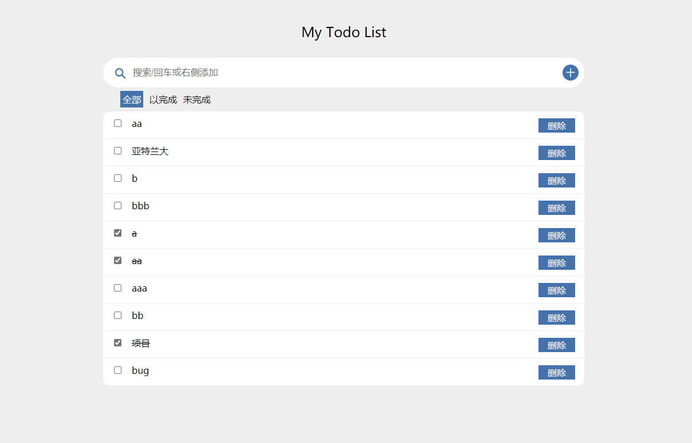
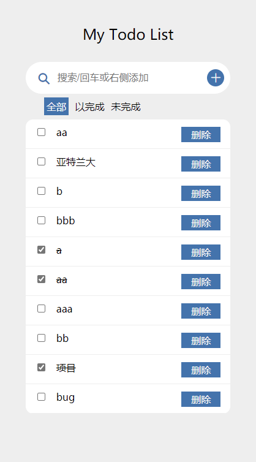

# My Todo List
## 介绍

项目基于`html`,`css`,`javascript`,`vue2`,`es6`实现的Todo List单页应用，

## 已完成功能

- [√]]  实现添加功能：输入框中可输入任意字符，按回车后将输入TODO项添加到下方列表的最后，并清空输入框
- [√] 实现删除功能：点击列表项后面的“X”号，可以删除该项
- [√] 实现搜索模糊匹配：在搜索框中输入字符后，将当前输入字符串与已添加的列表项进行模糊匹配，将匹配到的结果显示在输入框下方。如匹配不到任何列表项，列表显示空
- [√] 实现待做list和已做list，并支持将待做的选中后，添加进已做
- [√]  实现编辑功能
- [√] 实现持久化存储、刷新页面不会丢失

## gitHub-Page 预览地址

[My todo list](https://liqiujiong.github.io/todo-list/) - `main` 分支

<p align="center">
    
    
</p>

### 建议开发环境

- `Git`: - 版本管理工具
- `Visual Studio Code` - (VSCode): 最新版本

## 安装

```js
// 拉取项目代码

git clone https://gitee.com/liqiujiong/interview-todo-list.git
```

## 使用

-  直接运行index.html